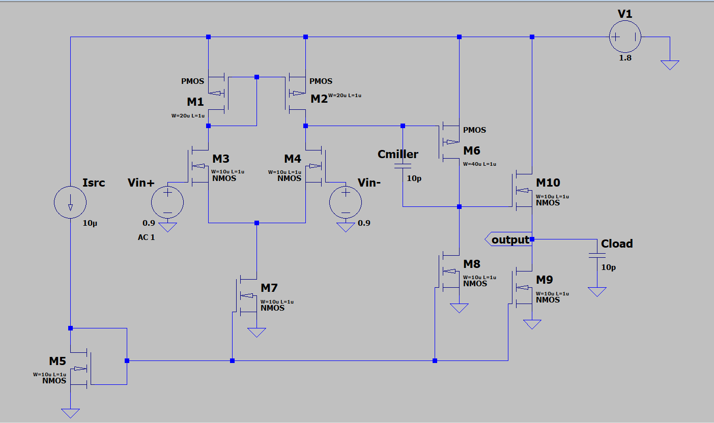
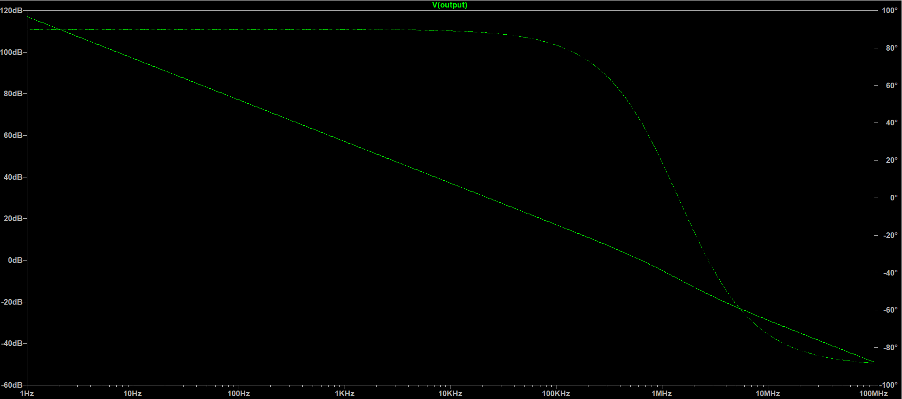
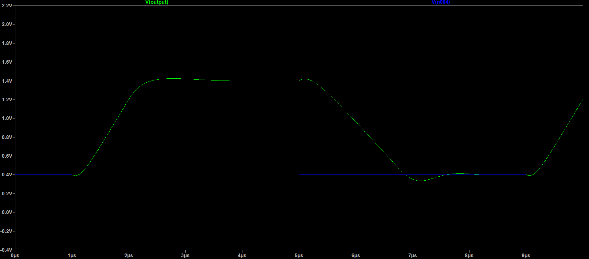

# Two-Stage CMOS Operational Amplifier

## Overview
This repository contains the transistor-level design and LTspice simulation files for a 1.8V Two-Stage CMOS Operational Amplifier featuring a source-follower output buffer. This project focuses on fundamental analog VLSI design principles, specifically addressing systematic offset correction, current density scaling, and AC stability through Miller frequency compensation.

## Core Performance Specifications (Baseline Design)
| Parameter | Value | 
| :--- | :--- |
| **Technology / Supply Voltage** | 1.8V |
| **Open-Loop DC Gain** | 117 dB |
| **Unity Gain Bandwidth (UGB)** | 631.8 kHz |
| **Phase Margin** | 40.5° |
| **Slew Rate** | 0.81 V/µs |
| **Compensation Network** | 10 pF Capacitor |
| **Load Capacitor** | 10 pF |

## Primary Design Highlights
* **DC Biasing & Offset Correction:** Eliminated railed output conditions by tracing systematic offsets in the current mirrors. Scaled the W/L ratios of the common-source amplification stage to perfectly match the current density of the differential pair, ensuring all MOSFETs operate deep in the saturation region with an output resting voltage of ~0.76V.
* **Frequency Compensation:** Implemented a 10 pF Miller capacitor across the high-gain stage to establish a dominant pole, intentionally trading excess bandwidth for AC stability and a stable phase margin.
* **Transient Response:** Verified large-signal behavior by wiring the amplifier in a closed-loop unity-gain buffer configuration and driving it with a 0.4V to 1.4V square wave pulse, measuring a 0.81 V/µs slew rate.

---

## Post-Submission Optimization: Lead Compensation (V2.0)
*Continuous improvement and advanced AC stability optimization.*

Following the initial design phase, the circuit was further analyzed to address the slight transient ringing caused by the Right-Half-Plane (RHP) zero inherent in standard Miller compensation. 

* **The Upgrade:** A **10kΩ nulling resistor** was added in series with the 10 pF Miller capacitor to execute advanced Lead Compensation.
* **The Result:** This successfully blocked the feed-forward path, pushing the RHP zero to the left half-plane.
* **New Metrics:** The phase margin drastically improved to an industry-standard **63.4°**, resulting in a perfectly damped step response with a **0.68 V/µs slew rate** and absolute zero overshoot. 
* *(Note: See `twostage_opamp_LeadComp.asc` and the `version2.pdf` plots in the repository files for this upgraded configuration).*

---

## Simulation Results
*(Included in repository files as standard `.png` screenshots and academic Black & White `.pdf` plots)*

### 1. Complete Schematic

*Baseline circuit diagram including the differential pair, common-source stage, and output buffer.*

### 2. AC Analysis (Bode Plot)

*Open-loop frequency response showing 117 dB gain and phase stability.*

### 3. Transient Analysis (Slew Rate)

*Closed-loop step response chasing a 0.4V to 1.4V square wave.*

## How to Run the Simulations
1. Download and install [LTspice](https://www.analog.com/en/design-center/design-tools-and-calculators/ltspice-simulator.html).
2. Clone this repository and open the desired `.asc` file in LTspice.
3. The schematic contains three pre-written SPICE directives:
   * `.op` (DC Operating Point)
   * `.ac dec 100 1 100Meg` (AC Analysis for Gain/Phase)
   * `.tran 0 10u` (Transient Analysis for Slew Rate)
4. Ensure only **one** directive starts with a period (`.`) at a time. Comment out the others by changing the period to a semicolon (`;`).
5. Click the **Run** (running person) icon to execute the active simulation.
