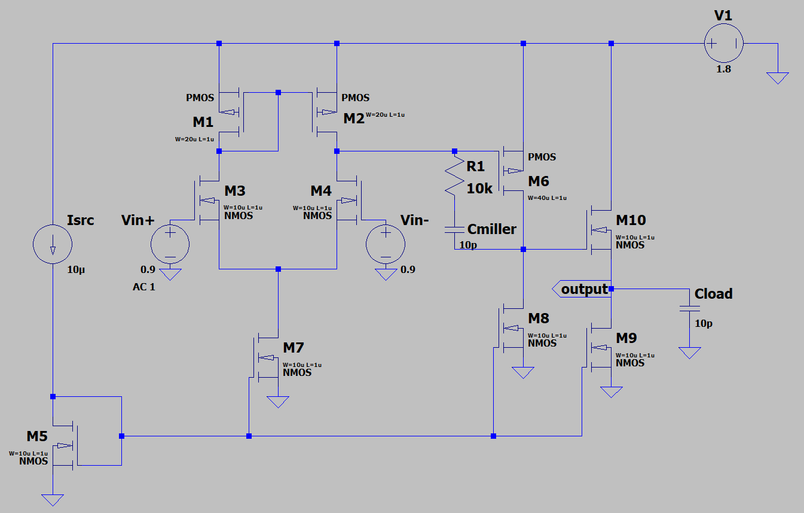
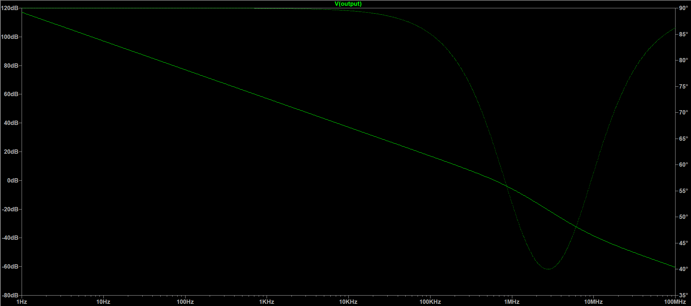
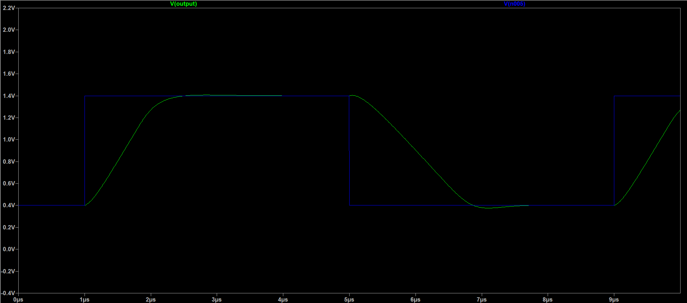

# Two-Stage CMOS Operational Amplifier with Lead Compensation

## Overview
This repository contains the transistor-level design and LTspice simulation files for a **1.8V Two-Stage CMOS Operational Amplifier** featuring a **Source-Follower Output Buffer** and **RC Lead Compensation**. 

The design focuses on core analog VLSI design principles, incorporating systematic offset correction through current density scaling, dominant-pole frequency compensation, and an **RHP zero-nulling resistor** to achieve an industry-standard phase margin and clean transient response.

---

## Core Performance Specifications
| Parameter | Value | Details / Condition |
| :--- | :--- | :--- |
| **Technology / Supply Voltage** | **1.8 V** | Single supply ($V_{DD}$) |
| **Open-Loop DC Gain** | **117 dB** | High low-frequency amplification (~700,000×) |
| **3-dB Bandwidth ($f_{-3\text{dB}}$)** | **1.42 Hz** | Dominant pole frequency |
| **Unity Gain Bandwidth (UGB)** | **610.52 kHz** | Frequency at 0 dB gain |
| **Phase Margin** | **63.35°** | Optimally damped stability target ($>60^\circ$) |
| **Slew Rate** | **0.96 V/µs** | Measured on steep linear rise ($0.958\text{ V}/\mu\text{s}$) |
| **Compensation Network** | **10 pF + 10 kΩ** | Miller capacitor ($C_m$) + Nulling resistor ($R_{null}$) |
| **Load Capacitance ($C_L$)** | **10 pF** | Driven via output buffer stage |
| **Output Resting Voltage** | **~0.76 V** | Balanced for maximum output swing |

---

## Key Design Highlights

### 1. Circuit Architecture
* **Stage 1 (Differential Pair - M1–M4):** Converts differential input signals ($V_{in+}$, $V_{in-}$) to a single-ended output while rejecting common-mode noise.
* **Stage 2 (Common-Source Stage - M6):** Provides the bulk of the high voltage gain.
* **Stage 3 (Source-Follower Buffer - M9, M10):** Isolates the high-impedance gain node, enabling the amplifier to drive a 10 pF load without gain degradation.

### 2. RC Lead Compensation (Nulling Resistor)
* **Miller Capacitor ($C_m = 10\text{ pF}$):** Establishes a dominant low-frequency pole at 1.42 Hz to stabilize the open-loop frequency response.
* **Nulling Resistor ($R_1 = 10\text{ k}\Omega$):** Placed in series with $C_m$ to block high-frequency feed-forward signals and eliminate the inherent Right-Half-Plane (RHP) zero. Moving the zero into the Left-Half-Plane provides a phase lead boost, achieving a highly stable **63.35°** phase margin.

### 3. DC Biasing & Systematic Offset Mitigation
* Matched current densities and scaled transistor aspect ratios ($W/L$) ensure all MOSFETs operate deep within the saturation region.
* Eliminates systematic DC offset, maintaining a stable DC output resting voltage of ~0.76 V to avoid railing.

---

## Simulation Results

### 1. Circuit Schematic

*Complete schematic illustrating the differential pair, common-source stage, source-follower buffer, and the 10 kΩ + 10 pF lead compensation network.*

### 2. AC Frequency Response (Bode Plot)

*Open-loop frequency response demonstrating 117 dB DC gain, 1.42 Hz 3-dB cutoff, 610.52 kHz UGB, and a 63.35° phase margin.*

### 3. Transient Step Response (Slew Rate)

*Closed-loop unity-gain buffer response driving a 0.4V to 1.4V square pulse, showcasing a linear slew rate of 0.96 V/µs with zero overshoot or ringing.*

---

## How to Run the Simulations

1. Download and install [LTspice](https://www.analog.com/en/design-center/design-tools-and-calculators/ltspice-simulator.html).
2. Clone this repository and open `twostage_opamp_LeadComp.asc` in LTspice.
3. The schematic contains three pre-configured SPICE directives:
   * **`.op`** — DC Operating Point analysis (verifies transistor operating regions).
   * **`.ac dec 100 1 100Meg`** — AC Frequency sweep (generates Bode plot for Gain, UGB, and Phase Margin).
   * **`.tran 0 10u`** — Transient analysis (measures large-signal step response and Slew Rate).
4. Ensure **only one** directive starts with a period (`.`) at a time. Comment out inactive directives by changing the dot to a semicolon (`;`).
5. Click **Run** (running person icon) to execute the active simulation.
